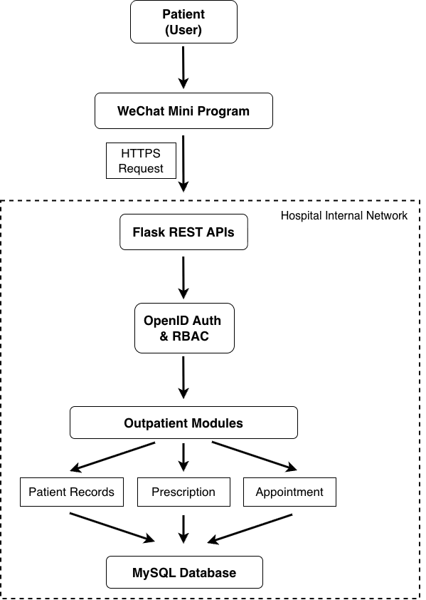
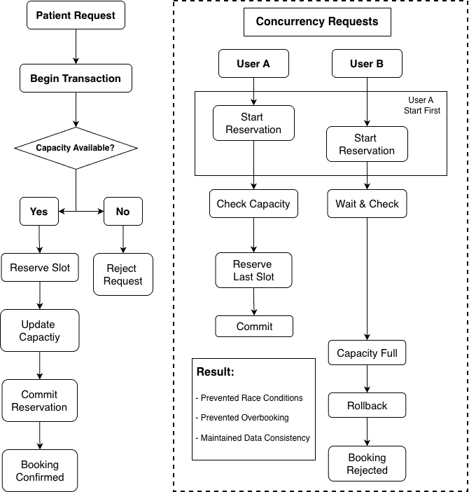

# Healthcare Appointment System

Production healthcare platform developed for Beijing Hospital for the Elderly.

> Source code cannot be released due to healthcare privacy regulations and hospital confidentiality requirements.

---

## System Architecture

  

  <i>Overall Architecture of the Platform</i>

---

## Tech Stack

| Layer | Technology |
|---------|---------|
| Frontend | WeChat Mini Program |
| Backend | Flask |
| Database | MySQL |
| Authentication | WeChat OpenID |
| Authorization | RBAC |
| Deployment | Hospital Internal Network |

---

## Core Modules

### Patient Record Retrieval

Provides authenticated access to outpatient visit history.

**Responsibilities**

- Query patient visit records
- Retrieve historical treatment information
- Restrict access to authorized users

### Prescription Management

Provides secure access to prescription information.

**Responsibilities**

- Prescription lookup
- Medication record retrieval
- Authenticated access control

### Appointment Scheduling

Manages outpatient booking workflows.

**Responsibilities**

- Capacity tracking
- Slot reservation
- Conflict prevention
- Availability synchronization

---

## Authentication Flow

User Login -> WeChat Authentication -> OpenID ->   
Backend Verification -> Session Creation -> Authorized Access

---

## Transaction-Safe Appointment Scheduling

Concurrent booking requests may attempt to reserve the final available appointment slot.

  

  <i>Concurrency-Controlled Scheduling</i>

### Result

- Prevented race conditions
- Prevented overbooking
- Maintained scheduling consistency

---

## Deployment

The platform was deployed on hospital internal infrastructure to satisfy healthcare privacy and patient-data protection requirements.

---

## Scale

- Production deployment
- 3,000+ patient visits supported
- Daily outpatient operation usage
- 8-member development team

---

## Confidentiality Notice

This repository contains documentation only.

Source code, deployment details, database schemas, and patient data remain confidential due to healthcare privacy regulations and hospital security requirements.